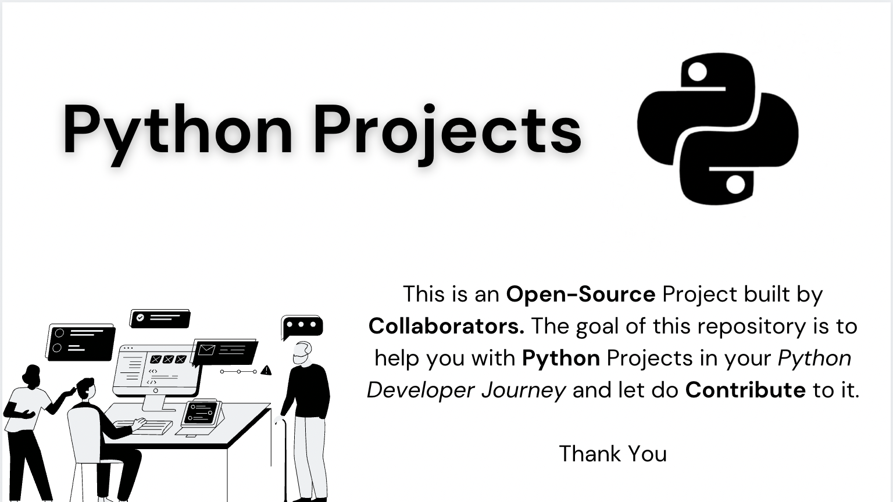

# Open-Source Python Projects by Contributors to Dev Community!

 

    
    
    
    
    
    
    
     

 

 

# Introduction

The repository was built with a tree-like structure in mind, it contains collections of **Python Projects**. Most people are afraid of Good Projects, which keeps them from getting into Python programming. It's not true, anyone can learn Python, and we plan to make it happen. The repository is open to anyone, whether you are a beginner or an expert developer.

 

> We believe that Developing projects is more important than just learning theory. ✅   Please Follow Our [Contribution Guidelines](CONTRIBUTING.md) Strictly.

 

# Resources

Here are the [resources](./resources) to get you started with the fundamentals of Python.

- [Python Websites](https://github.com/gaurtvin/python-projects/tree/master/resources#python-websites)
- [Python Books](https://github.com/gaurtvin/python-projects/tree/master/resources#python-books)
- [Python Repository](https://github.com/gaurtvin/python-projects/tree/master/resources#python-repositories)
- [Python Course/Videos](https://github.com/gaurtvin/python-projects/tree/master/resources#python-coursesvideos)

 

# Project List

<table width="100%" class="table">
<tr>
<th>S.No</th>
<th>Name</th>
<th>Author</th>
</tr>
<tr><td>1.</td><td><a target="_blank" href="https://github.com/gaurtvin/python-projects/tree/master/projects/Digital-Clock-GUI">Digital Clock GUI</a></td><td><a href="https://github.com/gaurtvin"> Gaurav Pandey</a></td></tr>
<tr><td>2.</td><td><a target="_blank" href="https://github.com/gaurtvin/python-projects/tree/master/projects/Tic-Tac-Toe">Tic Tac Toe GUI</a></td><td><a href="https://github.com/TanCodes"> Tanmay Barvi</a></td></tr>
<tr><td>3.</td><td><a target="_blank" href="https://github.com/gaurtvin/python-projects/tree/master/projects/Simple-Quote-Bot">Simple Quote Bot</a></td><td><a href="https://github.com/gaurtvin"> Gaurav Pandey</a></td></tr>
<tr><td>4.</td><td><a target="_blank" href="https://github.com/gaurtvin/python-projects/tree/master/projects/Windows-Message-Notifier">Windows Desktop Message Notifier GUI</a></td><td><a href="https://github.com/gaurtvin"> Gaurav Pandey</a></td></tr>
<tr><td>5.</td><td><a target="_blank" href="https://github.com/gaurtvin/python-projects/tree/master/projects/Url-Shortner">URL Shortner</a></td><td><a href="https://github.com/gaurtvin"> Gaurav Pandey</a></td></tr>
<tr><td>6.</td><td><a target="_blank" href="https://github.com/gaurtvin/python-projects/tree/master/projects/Countdown-Timer">Countdown Timer</a></td><td><a href="https://github.com/Mannuel25"> Emmanuel Tanimowo</a></td></tr>
<tr><td>7.</td><td><a target="_blank" href="https://github.com/gaurtvin/python-projects/tree/master/projects/Number-Guessing-Game">Number Guessing Game</a></td><td><a href="https://github.com/Mannuel25"> Emmanuel Tanimowo</a></td></tr>
<tr><td>8.</td><td><a target="_blank" href="https://github.com/gaurtvin/python-projects/tree/master/projects/Password-Generators">Password Generators</a></td><td><a href="https://github.com/Mannuel25"> Emmanuel Tanimowo</a></td></tr>
<tr><td>9.</td><td><a target="_blank" href="https://github.com/gaurtvin/python-projects/tree/master/projects/Rock-Paper-Scissors">Rock Paper Scissors Game</a></td><td><a href="https://github.com/sanjuth"> Sanjuth Reddy</a></td></tr>
<tr><td>1o.</td><td><a target="_blank" href="https://github.com/gaurtvin/python-projects/tree/master/projects/Palindrome-Number">Palindrome Number Checker</a></td><td><a href="https://github.com/sulavmhrzn"> Sulav Maharjan</a></td></tr>
<tr><td>11.</td><td><a target="_blank" href="https://github.com/gaurtvin/python-projects/tree/master/projects/Password-Hashing">Password Hashing</a></td><td><a href="https://github.com/Mannuel25"> Med Amine Fh </a></td></tr>
<tr><td>12.</td><td><a target="_blank" href="https://github.com/gaurtvin/python-projects/tree/master/projects/Password-Validator">Password Validator</a></td><td><a href="https://github.com/medaminefh"> Emmanuel Tanimowo </a></td></tr>
<tr><td>13.</td><td><a target="_blank" href="https://github.com/gaurtvin/python-projects/tree/master/projects/Code-Editor-GUI">Simple Python Code Editor GUI</a></td><td><a href="https://github.com/edemgold">Edem Gold</a></td></tr>
<tr><td>14.</td><td><a target="_blank" href="https://github.com/gaurtvin/python-projects/tree/master/projects/Space-Invaders">Space Invaders GUI</a></td><td><a href="https://github.com/gaurtvin">Gaurav Pandey</a></td></tr>
<tr><td>15.</td><td><a target="_blank" href="https://github.com/gaurtvin/python-projects/tree/master/projects/Bank-Management-Project">Bank Management System</a></td><td><a href="https://github.com/abhishekgit03">Abhishek Dasgupta</a></td></tr>    
<tr><td>16.</td><td><a target="_blank" href="https://github.com/gaurtvin/python-projects/tree/master/projects/Cards-Game">Cards Game</a></td><td><a href="https://github.com/paiyarohit"> Rohit Paiya</a></td></tr>
<tr><td>17.</td><td><a target="_blank" href="https://github.com/gaurtvin/python-projects/tree/master/projects/Quizminds-GUI">Quizminds GUI</a></td><td><a href="https://github.com/abhishekgit03"> Abhishek Dasgupta</a></td></tr>
<tr><td>18.</td><td><a target="_blank" href="https://github.com/gaurtvin/python-projects/tree/master/projects/Realcaller">Real Caller GUI</a></td><td><a href="https://github.com/TanCodes">Tanmay Barvi</a></td></tr>
<tr><td>19.</td><td><a target="_blank" href="https://github.com/gaurtvin/python-projects/tree/master/projects/Display-Calender">Calender GUI</a></td><td><a href="https://github.com/adarshgowdaa">A Adarsh</a></td></tr>
<tr><td>20.</td><td><a target="_blank" href="https://github.com/gaurtvin/python-projects/tree/master/projects/Notifier-Desktop-App">Notifier Desktop App</a></td><td><a href="https://github.com/TanCodes">Tanmay Barvi</a></td></tr>
<tr><td>21.</td><td><a target="_blank" href="https://github.com/gaurtvin/python-projects/tree/master/projects/Search-Book">Search Book</a></td><td><a href="https://github.com/abhishekgit03">Abhishek Dasgupta</a></td></tr>
<tr><td>22.</td><td><a target="_blank" href="https://github.com/gaurtvin/python-projects/tree/master/projects/Web-Server">Simple Web Server</a></td><td><a href="https://github.com/sulavmhrzn">Sulav Maharjan</a></td></tr>
<tr><td>23.</td><td><a target="_blank" href="https://github.com/gaurtvin/python-projects/tree/master/projects/FlappyBirdGame">Flappy Bird Game</a></td><td><a href="https://github.com/INNOMIGHT">Vaibhav Shrivastava</a></td></tr>
</table>

 

# Contribution

Feel free to add more Projects to this repository by either creating an issue or making a Pull Request. Join our [Discord Server](https://discord.gg/dWeV3pjqu2) for the latest updates, further discussion about your pull request.

See our [Contribution Guidelines](CONTRIBUTING.md) to get started. Also please see [**README PROJECT TEMPLATE**](https://github.com/gaurtvin/python-projects/blob/master/.github/README_PROJECT_TEMPLATE.md) before making a pull request.

 

# Our Contributors

<table style="border:none">
    <tr>
        <td>
            
        </td>
    </tr>
</table>

Be the next to contribute and you'll see yourself in this chart!

 

# License

This repository is under an [MIT](https://choosealicense.com/licenses/mit/) License. For any kind of broken link or anything with is not following community guidelines please create a new issue with **invalid** label.
    
 
    
# Thanks, Happy Coding!
